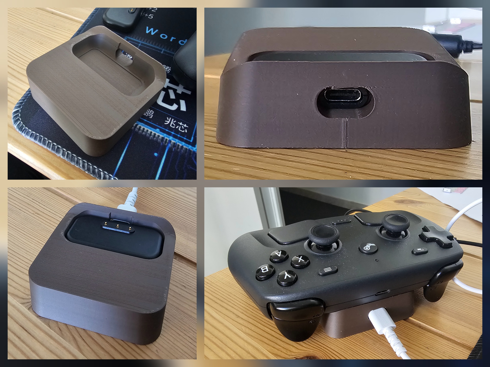
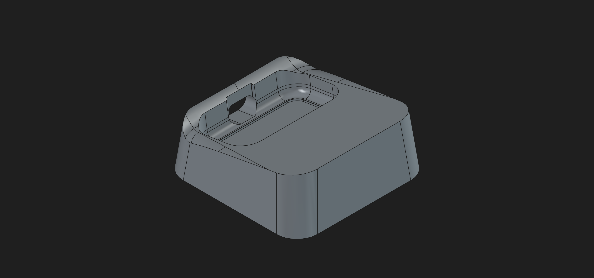
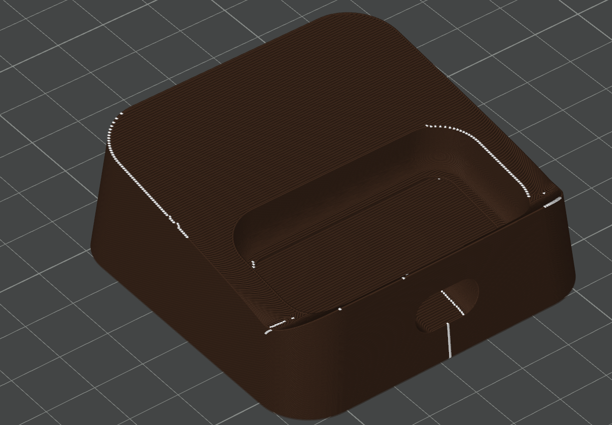
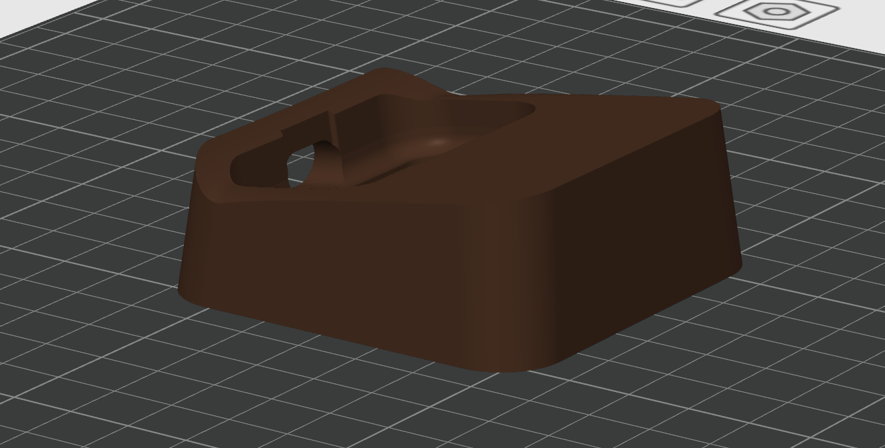

# Steam Controller Dock

A minimal and compact desktop dock for the Steam Controller, designed in FreeCAD and optimized for support-free 3D printing.

---

## Features

* Compact desktop footprint
* Rounded industrial-style design
* Stable angled support for the Steam Controller
* Support-free printing
* Open-source CAD files included
* STEP export for compatibility with other CAD software

---

## Gallery

### CAD Preview

### Sliced Preview

### Printed Model

---

## Files Included

| File                          | Description           |
| ----------------------------- | --------------------- |
| `steam_controller_dock.FCStd` | Native FreeCAD source |
| `steam_controller_dock.step`  | STEP CAD export       |
| `steam_controller_dock.stl`   | Printable STL mesh    |
| `steam_controller_dock.3mf`   | Bambu Studio project  |

---

## Printing

The model is designed to print without supports.

### Recommended Settings

| Setting           | Value      |
| ----------------- | ---------- |
| Layer Height      | 0.08 mm    |
| Infill            | 15%        |
| Supports          | No         |
| Material          | PLA / PETG |
| Wall Count        | 3          |
| Top/Bottom Layers | 5          |

### Notes

* PETG is recommended for better durability.
* PLA works well for indoor desktop use.
* A textured PEI plate gives the best bottom finish.

---

## CAD

Designed entirely in FreeCAD.

The repository includes:

* editable FreeCAD source files
* STEP export for interoperability
* printable mesh files

---

## Open Source

This project is open-source and released under the:

**CC BY-NC-SA 4.0 License**

You are free to:

* share
* modify
* remix
* redistribute

Under the following conditions:

* attribution required
* non-commercial use only
* derivatives must remain under the same license

Commercial use is prohibited without permission.

More information:
https://creativecommons.org/licenses/by-nc-sa/4.0/

---

## Compatibility

Designed for the original Steam Controller.

Compatibility with modified shells or accessories is not guaranteed.

---

## Contributing

Suggestions, improvements, and remixes are welcome.

If you improve the design, feel free to open a pull request or share your remix.

---

## Author

Jeff

---

## License

This project is licensed under the Creative Commons Attribution-NonCommercial-ShareAlike 4.0 International License.

© 2026 Jeff
